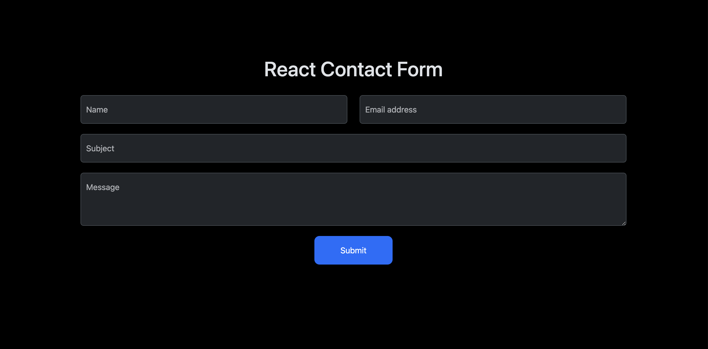

# React Contact Form

React Contact Form is an application that was built to serve as a template to those who want to create a contact form in react without any back-end code.

---

### How it works

When a user naviagtes to the page, they are brought to a basic contact form that was built with `Bootstrap`. Input field data, form validation, and reset functionality is handled by `react-hook-form`. Once a user submits a valid form, `EmailJS` is used to send out an email of the completed contact form.

### Deployed App

https://react-contact-form-01.netlify.app/

---

### For development

1. Add the repository to your local machine.
2. Run `npm install` to install modules.
3. Open the application in your code editor of choice.
4. Add a `.env` file. Use `.env.example` as a reference.
5. Make any modifications to the code that you need.
6. Run `npm start` to start the application in development mode.

---

### Built with

- React
- React Hook Form
- EmailJS
- Bootstrap
- Vite

---

### Author

Keaton Sentak - [Portfolio](https://keatonsentak.dev) | [GitHub](https://github.com/ksentak)
